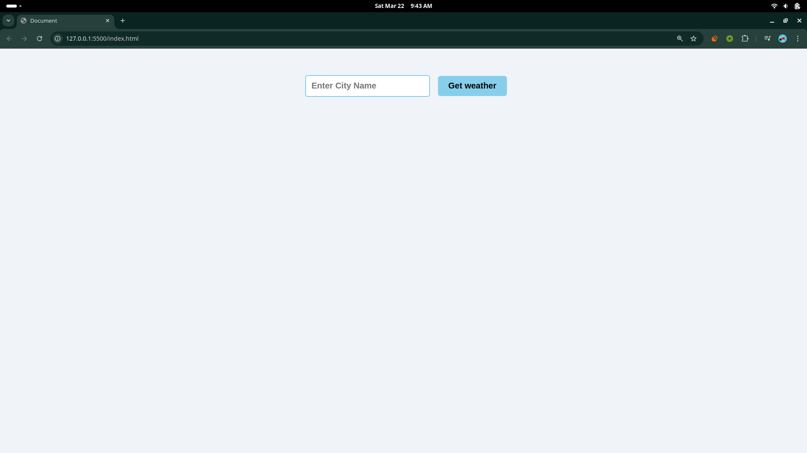
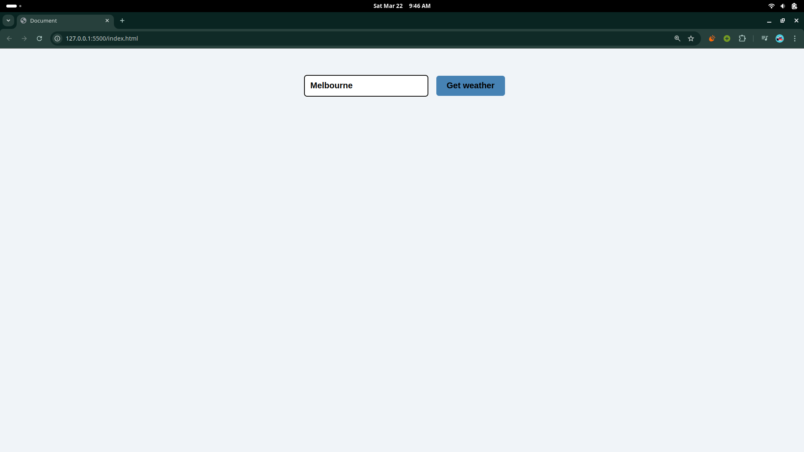
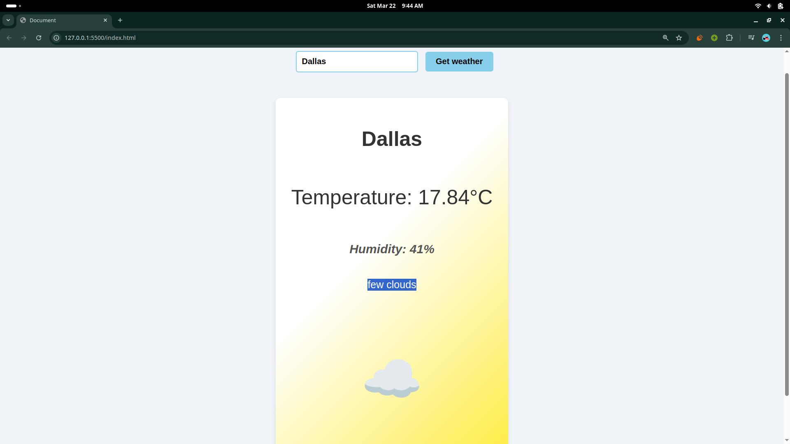
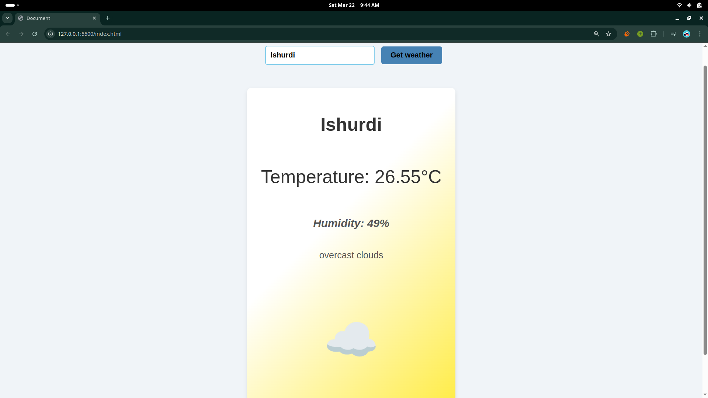

# Weather App

This is a simple Weather App built using JavaScript. It allows users to get the current weather information for any city.

## Features

- Fetches current weather data from an API
- Displays temperature, humidity, and weather conditions
- User-friendly interface

## Installation

1. Clone the repository:
    ```bash
    git clone https://github.com/Shakhoyat/weather-app.git
    ```
2. Navigate to the project directory:
    ```bash
    cd weather-app
    ```
3. Open `index.html` in your browser to view the app.

## Usage

1. Enter the name of the city in the input field.
2. Click the "Get Weather" button.
3. The current weather information will be displayed.

## Technologies Used

- HTML
- CSS
- JavaScript
- [OpenWeatherMap API](https://openweathermap.org/api)

## Screenshots

Here are some screenshots demonstrating the usage of the Weather App:

### Home Page


### Searching Page


### Weather Results


### My HomeTown Result


## API Status

The API is working perfectly, and the app is successfully fetching the correct weather information.
## Contributing

Contributions are welcome! Please fork the repository and create a pull request.

## License

This project is licensed under the MIT License.

## Acknowledgements

- [OpenWeatherMap](https://openweathermap.org/) for providing the weather data API.

## Contact

For any inquiries, please contact [skt104.shujon@gmail.com](mailto:skt104.shujon@gmail.com).
